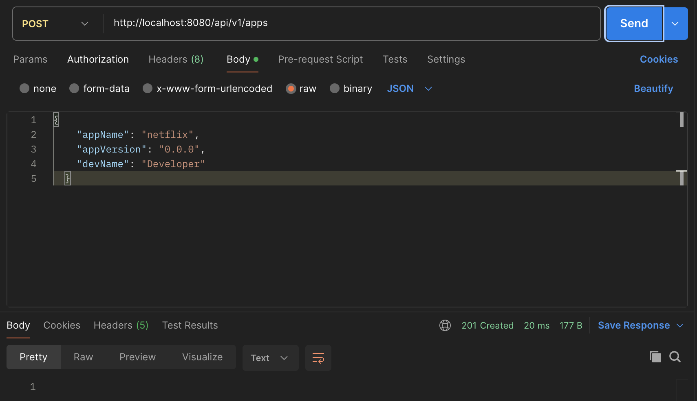
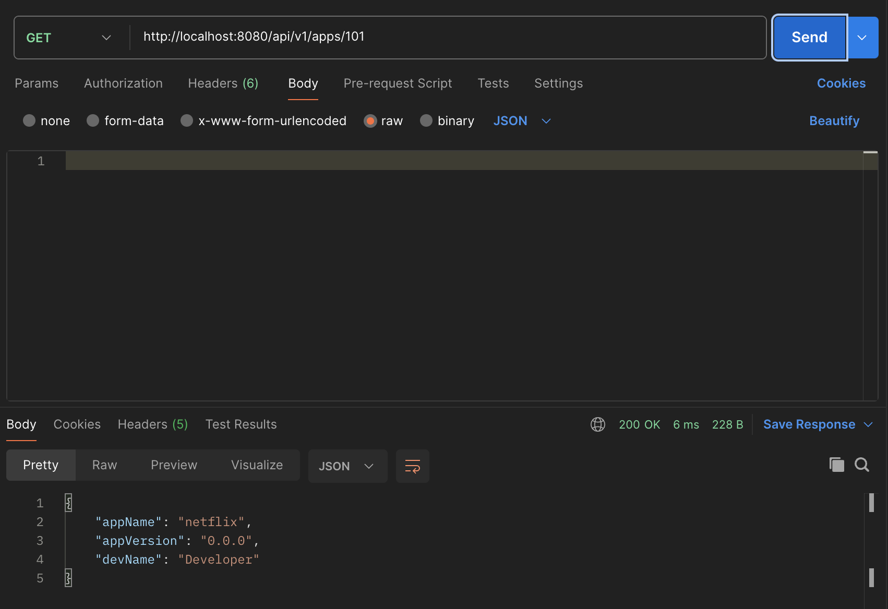
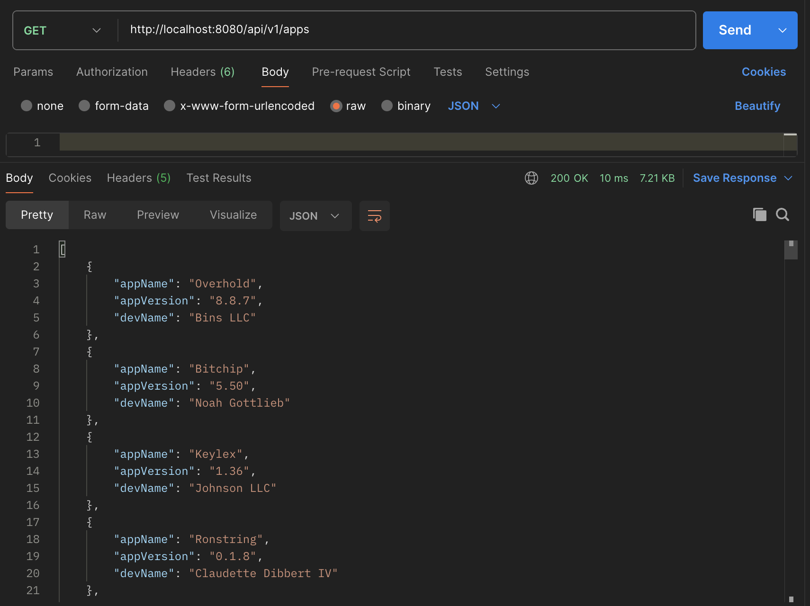
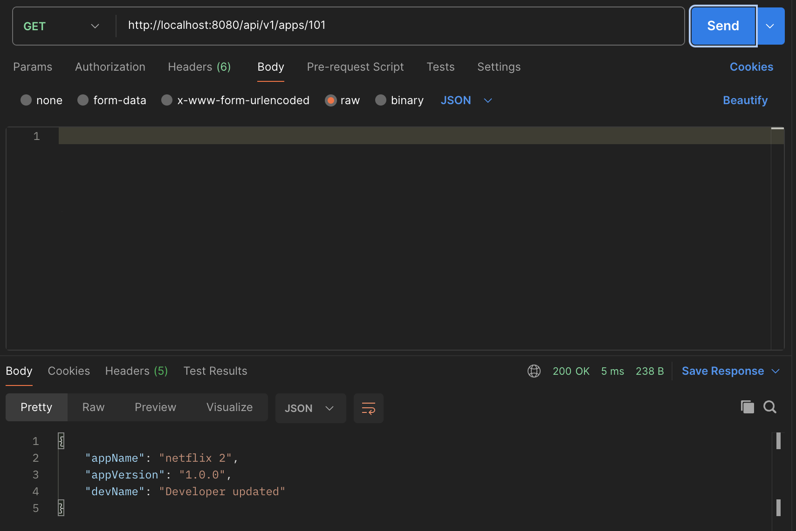
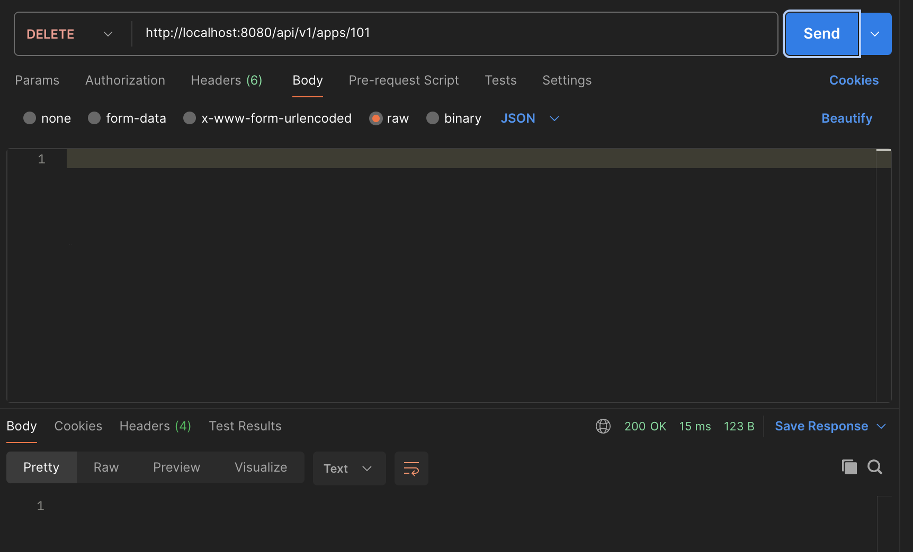
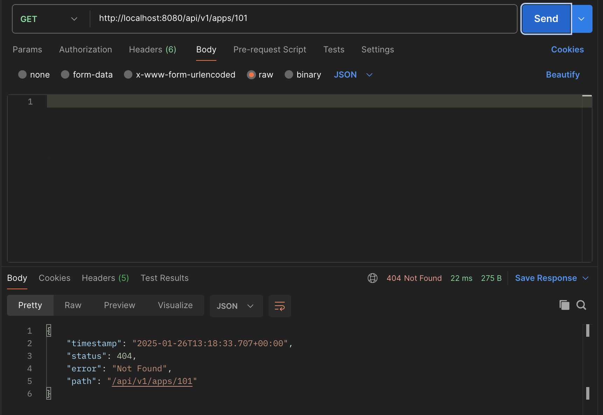

# Spring Boot CRUD Приложение  


## Введение  

### Spring Boot  
[Spring Boot](https://spring.io/projects/spring-boot) — это один из самых популярных проектов [Spring](https://spring.io/projects/spring-framework), который упрощает процесс настройки и развертывания корпоративных приложений. Он позволяет создавать автономные, готовые к производству приложения на основе Spring с минимальными усилиями. **Spring Boot** задуман как "субъективный фреймворк", так как он использует подход к конфигурации по умолчанию, что снижает трудозатраты разработчиков.

Каждое приложение на основе **Spring Boot** требует лишь определения Java-класса, аннотированного `@SpringBootApplication`, в качестве основной точки входа. Эта аннотация объединяет следующие аннотации:
- `@Configuration` – помечает класс как источник определения бинов.
- `@EnableAutoConfiguration` – указывает фреймворку автоматически добавлять бины на основе зависимостей, присутствующих в classpath.
- `@ComponentScan` – сканирует другие конфигурации и бины в том же пакете, что и класс приложения, или ниже.

### CRUD Приложение  
Самый распространённый способ начать использовать **Spring Boot** — это реализовать CRUD-приложение (от англ. **C**reate, **R**ead, **U**pdate, **D**elete). Я считаю это своеобразным "Hello World" для микросервисных фреймворков, так как основное его предназначение связано с созданием API. ***CRUD-приложение включает базовые функции, которые есть почти у каждого API.***

## Структура проекта  
При работе с проектами **Spring Boot** структура пакетов не является строго регламентированной, и фактическая структура зависит от ваших требований. Однако для удобства и простоты структура этого проекта организована, в основном, по паттерну MVC (**M**odel **V**iew **C**ontroller).

Основные папки проекта и их назначение:
- 📁 **application** – содержит главный класс, аннотированный `@SpringBootApplication`, который отвечает за запуск приложения.
- 📁 **builder** – содержит утилитный класс для преобразования сущностей в DTO (**D**ata **T**ransfer **O**bject) и обратно.
- 📁 **config** – содержит определения бинов через классы конфигурации Spring, аннотированные `@Configuration`.
- 📁 **controller** – содержит классы, аннотированные `@Controller`, которые обрабатывают входящие REST API-запросы.
- 📁 **exception** – содержит кастомные исключения для обработки нарушений целостности данных или бизнес-правил.
- 📁 **domain** – содержит POJO-классы (**P**lain **O**ld **J**ava **O**bject), аннотированные `@Entity`, которые представляют сущности базы данных.
- 📁 **dto** – содержит DTO-классы, которые используются для передачи данных через границы архитектуры.
- 📁 **repository** – содержит классы, аннотированные `@Repository`, которые обеспечивают механизм хранения, поиска, обновления и удаления объектов в базе данных.
- 📁 **service** – содержит классы, аннотированные `@Service`, в которых реализована бизнес-логика.

## Требования  
- Maven 3+  
- Java 8+  

## Библиотеки и зависимости  
- [Spring Web](https://docs.spring.io/spring-framework/docs/current/reference/html/web.html)  
- [Spring Data JPA](https://spring.io/projects/spring-data-jpa)  
- [JUnit 5](https://junit.org/junit5/)  
- [Mockito](https://site.mockito.org/)  
- [Hamcrest](http://hamcrest.org/)  
- [H2 Database](https://www.h2database.com/html/main.html)  
- [Lombok](https://projectlombok.org/)  
- [ModelMapper](http://modelmapper.org/)  
- [JavaFaker](https://github.com/DiUS/java-faker)  

## Пример проекта
Этот проект реализует API для управления приложениями, созданными вымышленной IT-компанией. Для каждого релиза приложения регистрируются его название, версия и разработчик. Используется база данных H2.

### Запуск приложения
1. Клонируйте репозиторий:
```bash
git clone https://github.com/Alexanderc16/spring-boot-fwad-rest
```  
2. Перейдите в папку:
```bash
cd spring-boot-fwad-rest
```  
3. Запустите приложение:
```bash
mvn spring-boot:run
```  

## Тестирование
1. `Создать новое приложение`
- URL: http://localhost:8080/api/v1/apps
- HTTP Метод: POST
- Тело запроса:
  ````json
  {
    "appName": "netflix",
    "appVersion": "0.0.0",
    "devName": "Developer"
  }
  ````
    

2. `Получить приложение`
- URL: http://localhost:8080/api/v1/apps/{appId}
- HTTP Метод: GET  
    


- URL: http://localhost:8080/api/v1/apps
- HTTP Метод: GET  
  
  **Примечание:** В соответствии со скриншотом, мы используем URI, который был указан в заголовке ответа предыдущего запроса.

3. `Обновить приложение`
- HTTP Метод: PUT
- URL: http://localhost:8080/api/v1/apps/{appId}
- Тело запроса:
  ````json
  {
    "appName": "netflix 2",
    "appVersion": "1.0.0",
    "devName": "Developer updated"
  }
  ````
    
    

4. `Удалить приложение`
- HTTP Метод: DELETE
- URL: http://localhost:8080/api/v1/apps/{appId}  
  

  Если попытаться найти удаленное приложение по его ID, сервер вернет HTTP статус 404:  
  
